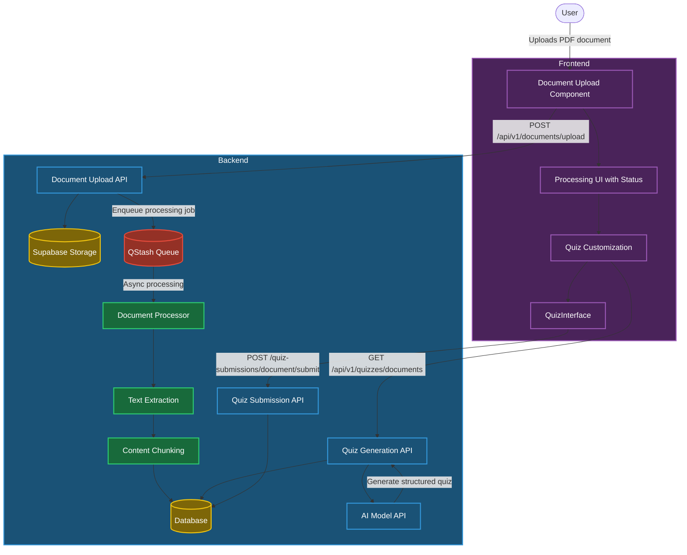

# Document Quiz Flow Implementation

IntelliQ features an advanced document processing system that allows users to upload documents, automatically extract content, and generate relevant quizzes without manual question creation. This documentation explains the technical implementation of this feature.

## Architecture Overview



The document quiz implementation in IntelliQ follows these key steps:

1. **Document Upload**: User uploads a document (currently PDF) through the UI
2. **Storage & Processing**: The document is stored and queued for asynchronous processing
3. **Text Extraction**: Content is extracted from the document and stored
4. **Content Chunking**: For large documents, content is split into meaningful chunks
5. **Quiz Generation**: AI generates quiz questions based on document content
6. **Interactive Quiz**: User takes the quiz with customized parameters
7. **Result Storage**: Quiz results are stored with document reference

## Technical Implementation

### Document Upload Flow

The file upload component handles the user interface portion:

```typescript
// apps/dashboard/src/components/document-library/file-upload.tsx (partial)
export function FileUpload({
  onChange,
  isLoading = false,
  accept = ".pdf,.doc,.docx,.txt",
}: FileUploadProps) {
  const [dragActive, setDragActive] = useState(false);
  const [selectedFile, setSelectedFile] = useState<File | null>(null);
  const [uploadProgress, setUploadProgress] = useState(0);
  const inputRef = useRef<HTMLInputElement>(null);

  // Handle file drop and selection
  const handleDrop = (e: React.DragEvent) => {
    e.preventDefault();
    e.stopPropagation();
    setDragActive(false);

    if (e.dataTransfer.files && e.dataTransfer.files.length > 0) {
      const file = e.dataTransfer.files[0];
      setSelectedFile(file);
      onChange([file]);
    }
  };
  
  // Additional component code...
}
```

The backend handles the upload request through the API endpoint:

```typescript
// apps/api/src/api/v1/documents.routes.ts (partial)
.post(
  "/upload",
  async (c) => {
    const supabase = getSupabase(c);
    const { data: { user } } = await supabase.auth.getUser();

    if (!user) {
      throw new HTTPException(401, { message: "Unauthorized" });
    }

    const formData = await c.req.parseBody();
    const file = formData["file"] as File;

    // Validate file type
    const fileExtension = file.name.split(".").pop()?.toLowerCase();
    if (!fileExtension || !ALLOWED_TYPES.has(fileExtension)) {
      throw new HTTPException(400, {
        message: "Unsupported file type. Allowed types: PDF",
      });
    }

    // Upload to storage
    const buffer = await file.arrayBuffer();
    const filePath = `${user.id}/${Date.now()}_${file.name}`;
    const { data, error } = await supabase.storage
      .from("documents")
      .upload(filePath, buffer, {
        contentType: ALLOWED_TYPES.get(fileExtension),
        upsert: false,
      });

    // Create database record
    const [document] = await db
      .insert(documents)
      .values({
        userId: user.id,
        fileUrl: signedUrl,
        content: "", // Will be populated by background processing
        metadata: {
          originalName: file.name,
          contentType: file.type,
          extension: fileExtension,
          uploadTimestamp: new Date().toISOString(),
          size: file.size,
          sizeInKb: Math.round(file.size / 1024),
          // Additional metadata...
        },
        processingStatus: "pending",
        // Additional fields...
      })
      .returning();

    // Queue background processing
    const client = new Client({ token: c.env.QSTASH_TOKEN });
    await client.queue({ queueName: "document-processing" }).enqueueJSON({
      url: `${c.env.API_URL}/api/v1/admin/documents/process`,
      body: {
        documentId: document.id,
        fileType: document.fileType,
      },
      headers: {
        Authorization: `Bearer ${c.env.ADMIN_TOKEN}`,
      },
    });

    return c.json({
      success: true,
      message: "Document uploaded successfully",
      data: {
        // Document data...
      }
    }, 201);
  }
)
```

### Document Processing

The document processing happens asynchronously through a queue:

```typescript
// apps/api/src/api/v1/admin/documents.routes.ts (partial)
.post(
  "/process",
  async (c) => {
    const { documentId, fileType } = c.req.valid("json");
    const db = await createDb(c);
    
    // Update processing status
    await db
      .update(documents)
      .set({
        processingStatus: "extracting_text",
      })
      .where(eq(documents.id, documentId));

    // Download file from storage
    const { data: fileData } = await supabase.storage
      .from("documents")
      .download(filePath);

    // Process based on file type
    let documentText = "";
    let pageCount = 0;

    try {
      const blob = new Blob([fileData], {
        type: `application/${fileType.toLowerCase()}`,
      });

      switch (fileType.toLowerCase()) {
        case "pdf": {
          const buffer = await blob.arrayBuffer();
          const pdf = await getDocumentProxy(new Uint8Array(buffer));
          const { totalPages, text } = await extractText(pdf, {
            mergePages: true,
          });
          documentText = text;
          pageCount = totalPages;
          break;
        }
        // Other file types...
      }

      // Save extracted text
      await db
        .update(documents)
        .set({
          content: documentText,
          pageCount,
          processingStatus: "chunking",
        })
        .where(eq(documents.id, documentId));

      // Create chunks for large documents
      const documentSizeKB = documentText.length / 1024;
      let chunks: string[] = [];
      
      // Split large documents into chunks
      if (documentSizeKB > 50) {
        const splitter = new RecursiveCharacterTextSplitter({
          chunkSize: 1000,
          chunkOverlap: 200,
        });
        const splitDocs = await splitter.splitText(documentText);
        chunks = splitDocs;
      } else {
        chunks = [documentText];
      }

      // Update metadata with chunk information
      await db
        .update(documents)
        .set({
          processingStatus: "completed",
          metadata: {
            // Metadata with chunk information...
          },
        })
        .where(eq(documents.id, documentId));

      return c.json({
        success: true,
        message: "Document processed successfully",
        // Additional info...
      });
    } catch (error) {
      console.error("Error processing document:", error);
      await db
        .update(documents)
        .set({ processingStatus: "failed" })
        .where(eq(documents.id, documentId));
      throw new HTTPException(500, { message: "Error processing document" });
    }
  }
)
```

### Quiz Generation

Once a document is processed, quizzes can be generated from its content:

```typescript
// apps/api/src/api/v1/quizzes.routes.ts (partial)
.get(
  "/documents",
  zValidator("query", documentQuizSchema),
  async (c) => {
    const { documentId, numberOfQuestions, language, quizType } =
      c.req.valid("query");

    const db = await createDb(c);

    // Get the document
    const document = await db.query.documents.findFirst({
      where: eq(documents.id, documentId),
      columns: {
        content: true,
        metadata: true,
        fileName: true,
        userId: true,
      },
    });

    // Verify user owns the document
    const supabase = getSupabase(c);
    const { data: { user } } = await supabase.auth.getUser();
    if (document.userId !== user!.id) {
      throw new HTTPException(403, {
        message: "Not authorized to access this document",
      });
    }

    // Use stored chunks from metadata if available, otherwise use full content
    const chunks = (document.metadata as any).chunks || [];
    const contextContent =
      chunks.length > 0 ? chunks.join("\n\n") : document.content;

    // Generate quiz with AI
    const { quiz, metrics } = await generateQuizFromDocument(
      c,
      contextContent,
      numberOfQuestions,
    );

    // Store usage data
    await db.insert(userUsageData).values({
      userId: user!.id,
      promptTokens: metrics.usage.promptTokens,
      completionTokens: metrics.usage.completionTokens,
      totalTokens: metrics.usage.totalTokens,
      // Additional usage metrics...
    });

    // Handle translation if needed
    if (language && language !== "en") {
      // Translation logic...
    }

    return c.json({ quiz: quiz });
  }
)
```

The actual quiz generation is handled by an AI model using structured generation:

```typescript
// apps/api/src/api/v1/services/documents-quiz-generator.service.ts
export async function generateQuizFromDocument(
  c: { env: { GPT_MODEL: string; OPENAI_API_KEY: string } },
  documentContent: string,
  numberOfQuestions: number,
): Promise<QuizGenerationResult> {
  try {
    const GPT_MODEL = c.env.GPT_MODEL;
    const startTime = performance.now();
    const openai = createOpenAI({
      apiKey: c.env.OPENAI_API_KEY,
    });

    const generatedQuiz = await generateObject({
      model: openai(GPT_MODEL, {
        structuredOutputs: true,
      }),
      schemaName: "document_quiz",
      schemaDescription:
        "A quiz with multiple-choice questions. Each question must have exactly 4 options.",
      schema: documentsQuizSchema,
      prompt: `${generateQuizPromptDocument(documentContent, numberOfQuestions)}
       
       IMPORTANT: For each question's options array, you MUST:
       1. Include exactly 4 options
       2. Use these exact prefixes in order: ${JSON.stringify(OPTION_PREFIXES)}
       3. Format each option as: prefix + " " + option text`,
      maxTokens: 1024,
      presencePenalty: 0.5,
      system: `You are creating a quiz with multiple choice questions. 
        Each question MUST have exactly 4 options - no more, no less.
        The correct answer must exactly match one of the options.
        Include letters a), b), c), d) in the options or answers.
        Important: Always provide exactly 4 options for each question.`,
    });

    const validatedQuiz = documentsQuizSchema.parse(generatedQuiz.object);

    // Validate option prefixes
    for (const question of validatedQuiz.questions) {
      if (
        !question.options.every((opt, i) => opt.startsWith(OPTION_PREFIXES[i]))
      ) {
        throw new Error("Invalid option format");
      }
    }

    const durationInSeconds = (performance.now() - startTime) / 1000;

    return {
      quiz: validatedQuiz,
      metrics: {
        durationInSeconds,
        usage: generatedQuiz.usage,
      },
    };
  } catch (error) {
    // Error handling...
  }
}
```

### Quiz Prompt Template

The system uses a specific prompt template to guide AI quiz generation:

```typescript
// apps/api/src/api/v1/services/prompts.ts
export const generateQuizPromptDocument = (
  documentContent: string,
  numberOfQuestions: number,
) => `
Generate a quiz JSON Object based on the content of this document: ${documentContent}.
Create ${numberOfQuestions} questions.

Once the quizTitle is set, it should not change. Each question should have a unique questionTitle. 
The questions must have exactly four options labeled a), b), c), and d).
The correctAnswer pattern can not be recognizable by the user and you can not use the same pattern for all the questions.
The Contextual questionTitle is not allowed to contain 'Question Number' or 'Interest Question Number', 
think of something very special for each individual question.`;
```

### Frontend Implementation

The frontend implements two primary components for document quiz generation:

1. A dashboard to manage documents and start quizzes:

```typescript
// apps/dashboard/src/components/document-library/document-dashboard.tsx (partial)
const startQuizOnDocument = async (documentId: string) => {
  const document = documents.find(
    (doc) => doc.id === Number.parseInt(documentId),
  );
  if (!document) return;

  // Check if document is ready
  if (document.processingStatus !== "completed") {
    toast({
      title: "Document not ready",
      description:
        "This document is still being processed. Please try again later.",
      variant: "destructive",
    });
    return;
  }

  try {
    setIsGenerating(true);

    // Reset quiz logic state
    if (quizContext?.dispatch) {
      quizContext.dispatch({ type: "RESET_QUIZ" });
    }

    // Generate quiz from document
    if (quizContext?.fetchDocumentQuestions) {
      const quizData = {
        documentId,
        number: 5, // Fixed at 5 questions
        quizLanguage: "en" as SupportedLanguages,
        showCorrectAnswers: true,
        passingScore: 50, // Fixed at 50% passing score
        quizType: QuizType.Enum.document,
        questions: [],
        topic: document.title || "Document Quiz",
        description: "Quiz generated from document",
        tags: ["document"],
      } as QuizData;

      await quizContext.fetchDocumentQuestions(quizData);

      // Redirect to the quiz PLAY page
      router.push("/single-player/quiz/play");
    }
  } catch (error) {
    // Error handling...
  } finally {
    setIsGenerating(false);
  }
};
```

2. A customization component for advanced quiz settings:

```typescript
// apps/dashboard/src/components/document-library/customize-quiz.tsx (partial)
export function CustomizeQuiz({ documentId }: { documentId: string }) {
  // State for quiz settings
  const [quizSettings, setQuizSettings] = useState({
    questionCount: 5,
    passingScore: 70,
    showCorrectAnswers: true,
    quizLanguage: "en",
  });

  const handleStartQuiz = async () => {
    try {
      setIsGenerating(true);

      // Update quiz creation context values
      setNumberValue(quizSettings.questionCount);
      setQuizLanguageValue(quizSettings.quizLanguage);
      setShowCorrectAnswersValue(quizSettings.showCorrectAnswers);
      setPassingScoreValue(quizSettings.passingScore);

      // Reset quiz logic state
      quizLogicDispatch({ type: "RESET_GAME_LOGIC" });

      // Generate quiz from document
      await fetchDocumentQuestions({
        documentId,
        number: quizSettings.questionCount,
        quizLanguage: quizSettings.quizLanguage as SupportedLanguages,
        showCorrectAnswers: quizSettings.showCorrectAnswers,
        passingScore: quizSettings.passingScore,
        quizType: "document",
        questions: [],
        topic: document?.title || "Document Quiz",
        description: document?.description || "Quiz generated from document",
        tags: ["document"],
      });

      // Redirect to the quiz PLAY page
      router.push("/single-player/quiz/play");
    } catch (error) {
      // Error handling...
    } finally {
      setIsGenerating(false);
    }
  };
}
```

### Data Schema

The system relies on a structured database schema:

```typescript
// apps/api/drizzle/schema.ts (partial)
export const documents = pgTable("documents", {
  id: bigserial("id", { mode: "number" }).primaryKey().notNull(),
  userId: uuid("user_id").notNull(),
  fileUrl: text("file_url").notNull(),
  content: text("content").notNull(),
  metadata: jsonb("metadata").notNull(),
  createdAt: timestamp("created_at", { withTimezone: true, mode: 'string' }).defaultNow().notNull(),
  fileName: text("file_name").notNull(),
  fileType: text("file_type").notNull(),
  fileSize: integer("file_size").notNull(),
  pageCount: integer("page_count").notNull(),
  processingStatus: processingStatus("processing_status").notNull(),
  lastAccessed: timestamp("last_accessed", { withTimezone: true, mode: 'string' }).defaultNow().notNull(),
  quizCount: integer("quiz_count").notNull(),
  embedding: vector({ dimensions: 1536 }),
  documentId: uuid("document_id").defaultRandom(),
});
```

Quiz submissions maintain a reference to their source document:

```typescript
// apps/api/drizzle/schema.ts (partial)
export const quizzes = pgTable("quizzes", {
  id: uuid().defaultRandom().primaryKey().notNull(),
  userId: uuid("user_id").notNull(),
  title: text().notNull(),
  description: text(),
  topic: text().array(),
  tags: text().array(),
  passingScore: smallint("passing_score"),
  documentId: bigint("document_id", { mode: "number" }),
  type: quizType().notNull(),
  // Additional fields...
}, (table) => [
  // Foreign key relationship
  foreignKey({
      columns: [table.documentId],
      foreignColumns: [documents.id],
      name: "quizzes_document_id_fkey"
    }).onUpdate("cascade").onDelete("cascade"),
  // Additional constraints...
]);
```

## Performance and Security Considerations

### Performance Optimizations

1. **Asynchronous Processing**: Document processing happens asynchronously using QStash to prevent blocking the main application flow
2. **Chunking Strategy**: Large documents are automatically split into smaller, meaningful chunks to avoid token limits
3. **Selective Content**: For very large documents, only a representative subset of chunks is used for quiz generation
4. **Status Polling**: Frontend polls for status updates to provide real-time feedback without server-sent events

### Security Measures

1. **Document Ownership**: All API endpoints validate that the requesting user owns the document
2. **Content Validation**: Extracted content is validated to prevent injection attacks
3. **Access Controls**: Supabase RLS policies restrict access to documents
4. **Rate Limiting**: Built-in protection against abuse of document processing resources
5. **Isolated Processing**: Background processing using admin tokens to prevent user impersonation

```typescript
// Example ownership check
if (document.userId !== user!.id) {
  throw new HTTPException(403, {
    message: "Not authorized to access this document",
  });
}
```

## Future Enhancements

1. **Additional File Types**: Support for DOCX, TXT, and other document formats
2. **Smart Chunking**: More sophisticated document chunking based on semantic boundaries
3. **Hierarchical Questions**: Questions at different difficulty levels or covering different topics
4. **Document Search**: Full-text and semantic search across documents
5. **AI Explanations**: Explanations for correct answers based on document content
6. **Interactive Document Links**: Questions that link back to the relevant document section

## Conclusion

The document quiz flow in IntelliQ leverages several advanced technologies to create a seamless experience:

1. **Cloud Storage**: For secure document storage
2. **Document Processing**: For text extraction and analysis
3. **Message Queues**: For reliable background processing
4. **AI Integration**: For intelligent quiz generation
5. **Vector Embeddings**: For potential semantic search (future enhancement)

This feature transforms static documents into interactive learning experiences, making it easy to test knowledge from any uploaded material.

Written by [Ricky Raveanu](mailto:contact@rickyraveanu.com)