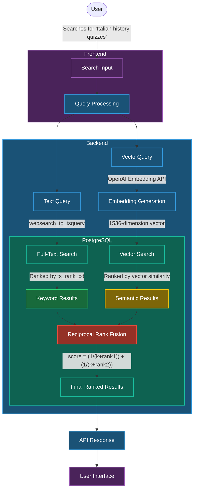

# Hybrid Search Implementation

IntelliQ implements a sophisticated hybrid search system that combines the strengths of both keyword-based (lexical) search and semantic (vector) search to provide highly relevant results when users search for quizzes.

## What is Hybrid Search?

Hybrid search combines two powerful search methodologies:

1. **Keyword Search (Full-Text Search)**: Matches specific words or phrases in content, excellent for finding exact matches.
2. **Semantic Search (Vector Search)**: Understands the meaning and context of a query, finding conceptually related content even when keywords don't match.

By combining these approaches, hybrid search delivers more comprehensive and relevant results than either method alone.

## Architecture Overview



The hybrid search implementation in IntelliQ follows these key steps:

1. **User Input**: The user enters a search query in the UI
2. **Query Processing**: The query is processed in two ways:
   - As text for keyword search
   - Converted to a vector embedding for semantic search
3. **Dual Search Execution**: Both search methods run in parallel in PostgreSQL
4. **Result Fusion**: Results are combined using Reciprocal Rank Fusion (RRF)
5. **Result Presentation**: The final ranked results are returned to the user

## Technical Implementation

### Database Function

At the core of our hybrid search is a PostgreSQL function that performs both search types and combines the results:

```sql
CREATE OR REPLACE FUNCTION hybrid_search_quizzes(
  query_text TEXT,
  query_embedding VECTOR(1536),
  user_id UUID,
  match_count INT DEFAULT 10,
  full_text_weight FLOAT DEFAULT 1.0,
  semantic_weight FLOAT DEFAULT 1.0,
  rrf_k INT DEFAULT 60
)
RETURNS TABLE (
  id UUID,
  title TEXT,
  description TEXT,
  topic TEXT[],
  tags TEXT[],
  type TEXT,
  language TEXT,
  created_at TIMESTAMPTZ,
  questions_count SMALLINT,
  user_score SMALLINT,
  correct_answers_count SMALLINT,
  generated_tags TEXT[],
  generated_categories TEXT[]
)
LANGUAGE SQL
AS $$
WITH full_text AS (
  SELECT
    id,
    ROW_NUMBER() OVER(
      ORDER BY 
        ts_rank_cd(
          setweight(to_tsvector('english', title), 'A') ||
          setweight(to_tsvector('english', COALESCE(description, '')), 'B') ||
          setweight(to_tsvector('english', array_to_string(topic, ' ')), 'C'),
          websearch_to_tsquery(query_text)
        ) DESC
    ) AS rank_ix
  FROM
    quizzes
  WHERE
    user_id = hybrid_search_quizzes.user_id
    AND (
      setweight(to_tsvector('english', title), 'A') ||
      setweight(to_tsvector('english', COALESCE(description, '')), 'B') ||
      setweight(to_tsvector('english', array_to_string(topic, ' ')), 'C')
    ) @@ websearch_to_tsquery(query_text)
  ORDER BY rank_ix
  LIMIT LEAST(match_count * 2, 100)
),
semantic AS (
  SELECT
    id,
    ROW_NUMBER() OVER (ORDER BY embedding <#> query_embedding) AS rank_ix
  FROM
    quizzes
  WHERE
    user_id = hybrid_search_quizzes.user_id
    AND embedding IS NOT NULL
  ORDER BY rank_ix
  LIMIT LEAST(match_count * 2, 100)
)
SELECT
  q.id,
  q.title,
  q.description,
  q.topic,
  q.tags,
  q.type::TEXT,
  q.language,
  q.created_at,
  q.questions_count,
  q.user_score,
  q.correct_answers_count,
  q.generated_tags,
  q.generated_categories
FROM
  full_text ft
  FULL OUTER JOIN semantic sem ON ft.id = sem.id
  JOIN quizzes q ON COALESCE(ft.id, sem.id) = q.id
WHERE
  q.user_id = hybrid_search_quizzes.user_id
ORDER BY
  (COALESCE(1.0 / (rrf_k + ft.rank_ix), 0.0) * full_text_weight +
   COALESCE(1.0 / (rrf_k + sem.rank_ix), 0.0) * semantic_weight) DESC
LIMIT
  match_count;
$$;
```

### Key Components Explained

#### 1. Embedding Generation

We use OpenAI's text-embedding-3-small model to generate embeddings for both quizzes and search queries:

```typescript
// Generate embedding for the search query
const openai = createOpenAI({
  apiKey: c.env.OPENAI_API_KEY,
});
const { embedding } = await embed({
  model: openai.embedding("text-embedding-3-small"),
  value: query,
});
```

For quizzes, we generate embeddings asynchronously using a queue system to avoid slowing down quiz creation:

```typescript
// In the queue handler
const textToEmbed = [
  quiz.title,
  quiz.description || '',
  quiz.topic.join(' '),
  (quiz.tags || []).join(' ')
].join(' ');

const embeddingResponse = await openai.embeddings.create({
  model: 'text-embedding-3-small',
  input: textToEmbed,
  dimensions: 1536,
});

const embedding = embeddingResponse.data[0].embedding;

// Update the quiz with the embedding
await db.update(quizzes)
  .set({ embedding })
  .where(eq(quizzes.id, quizId));
```

#### 2. Full-Text Search

The full-text search component uses PostgreSQL's built-in text search capabilities:

- `to_tsvector`: Converts text to a searchable format
- `websearch_to_tsquery`: Parses the user's query into a format suitable for searching
- `setweight`: Assigns different weights to different fields (title, description, topics)
- `ts_rank_cd`: Ranks results based on relevance

We prioritize matches in the title (weight A), then description (weight B), and finally topics (weight C).

#### 3. Semantic Search

The semantic search component uses pgvector's similarity search:

- `<#>` operator: Calculates the inner product distance between embeddings
- Smaller distances indicate higher similarity

#### 4. Reciprocal Rank Fusion (RRF)

RRF combines the rankings from both search methods:

```sql
ORDER BY
  (COALESCE(1.0 / (rrf_k + ft.rank_ix), 0.0) * full_text_weight +
   COALESCE(1.0 / (rrf_k + sem.rank_ix), 0.0) * semantic_weight) DESC
```

Where:
- `rank_ix`: The position of each result in its respective list
- `rrf_k`: A constant (default: 60) that smooths the impact of high rankings
- `full_text_weight` and `semantic_weight`: Control the relative importance of each search method

## API Implementation

Our API endpoint handles the search request, generates the embedding, and calls the database function:

```typescript
.post(
  "/search",
  describeRoute({
    tags: ["History"],
    summary: "Search user's quiz history",
    description: "Search user's quiz history with optional filtering",
    validateResponse: true,
    responses: {
      200: {
        description: "Quiz history retrieved successfully",
        content: {
          "application/json": {
            schema: resolver(quizHistoryResponseSchema),
          },
        },
      },
    },
  }),
  zValidator(
    "json",
    z.object({
      query: z.string(),
      page: z.number().default(1),
      limit: z.number().default(10),
    }),
  ),
  async (c) => {
    const { query, page, limit } = c.req.valid("json");

    const supabase = getSupabase(c);
    const {
      data: { user },
    } = await supabase.auth.getUser();

    const db = await createDb(c);

    // Generate embedding for the search query
    const openai = createOpenAI({
      apiKey: c.env.OPENAI_API_KEY,
    });
    const { embedding } = await embed({
      model: openai.embedding("text-embedding-3-small"),
      value: query,
    });

    const userQuizzes = await db.transaction(async (tx) => {
      // Execute the hybrid search
      const searchResults = await tx.execute(sql`
        SELECT 
          q.*,
          m.user_score AS "multiplayerScore",
          m.correct_answers_count AS "multiplayerCorrect",
          (q.questions_count - q.correct_answers_count) AS "incorrect"
        FROM hybrid_search_quizzes(
          ${query},
          ${sql.raw(`'[${embedding.join(",")}]'::vector(1536)`)},
          ${user!.id}::uuid,
          ${limit},
          1.0,
          1.0,
          60
        ) AS q
        LEFT JOIN multiplayer_quiz_submissions m ON m.quiz_id = q.id
        LIMIT ${limit}
        OFFSET ${(page - 1) * limit}
      `);

      // Format results for the frontend
      const quizResults = searchResults.map((quiz) => {
        // Format logic here...
      });

      return {
        data: quizResults,
        pagination: {
          page,
          limit,
          totalItems: Number(totalCount),
          totalPages: Math.ceil(Number(totalCount) / limit),
          hasNextPage: page * limit < Number(totalCount),
          hasPreviousPage: page > 1,
        },
      };
    });

    return c.json(userQuizzes);
  },
),
```

## Frontend Implementation

The frontend provides a seamless search experience:

```typescript
const handleSearch = async (e: React.FormEvent) => {
  e.preventDefault();
  if (!searchQuery.trim()) {
    fetchQuizHistory();
    return;
  }

  setIsSearching(true);
  setIsLoading(true);

  try {
    const client = createApiClient();
    const response = await client.api.v1.history.search.$post({
      json: {
        query: searchQuery,
        page: pagination.page,
        limit: pagination.limit,
      },
    });

    const responseData = await response.json();
    setQuizHistory(responseData.data);
    setPagination(responseData.pagination);
  } catch (error) {
    console.error("Search error:", error);
    toast({
      title: "Search failed",
      description: "Could not search quizzes. Please try again.",
      variant: "destructive",
    });
  } finally {
    setIsLoading(false);
  }
};
```

## Benefits of Hybrid Search

1. **Improved Relevance**: Finds both exact keyword matches and conceptually related content
2. **Better Recall**: Captures results that might be missed by either method alone
3. **Enhanced User Experience**: Users find what they're looking for even if they don't use exact terminology
4. **Flexibility**: Weights can be adjusted to favor either keyword or semantic search

## Performance Considerations

1. **Indexing**: Both search methods use appropriate indexes:
   - GIN index for full-text search
   - HNSW index for vector search

2. **Asynchronous Embedding Generation**: Embeddings are generated in the background to avoid slowing down quiz creation

3. **Pagination**: Results are paginated to limit the amount of data transferred

4. **Caching**: Frequently searched queries could be cached (future enhancement)

## Future Enhancements

1. **Personalized Ranking**: Adjust result ranking based on user preferences and history
2. **Multi-language Support**: Extend search capabilities to multiple languages
3. **Faceted Search**: Allow filtering of search results by various attributes
4. **Query Expansion**: Automatically expand queries to include related terms
5. **Performance Optimization**: Further optimize the search algorithm for larger datasets

## Conclusion

The hybrid search implementation in IntelliQ provides a powerful and flexible way for users to find relevant quizzes. By combining the strengths of keyword and semantic search, we deliver a superior search experience that understands both the exact words and the meaning behind a user's query.

Written by [Ricky Raveanu](mailto:contact@rickyraveanu.com)