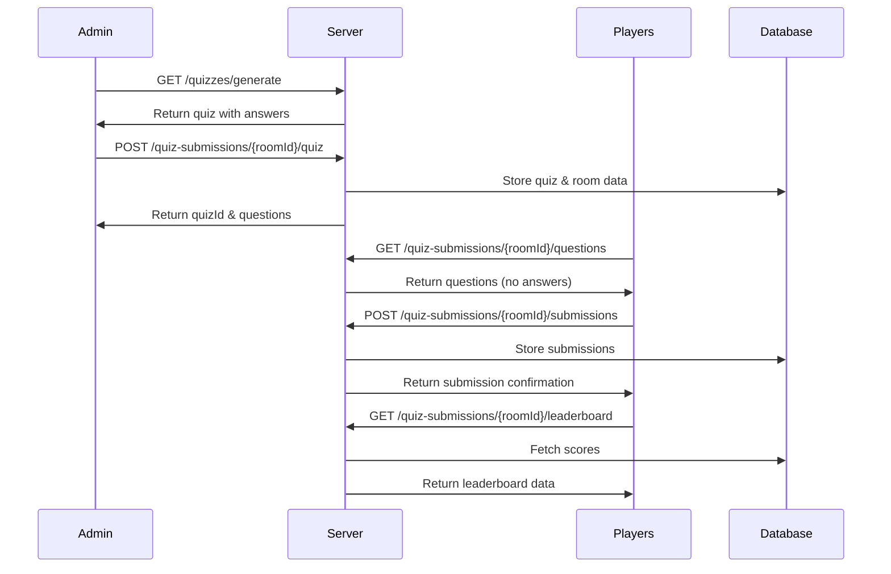

## Overview

The multiplayer quiz flow in IntelliQ involves several API endpoints that handle quiz generation, submission, and leaderboard functionality. This guide explains the complete flow from quiz creation to viewing results.

## Flow Diagram



<Steps>
  1. **Generate Quiz** (Admin Only)
     ```http
     GET /api/v1/quizzes/generate
     ```
     Generate a new quiz with specified parameters:
     ```bash
     ?quizTopic=formula%20one&numberOfQuestions=2&language=en&quizType=multiplayer
     ```
     The response includes the quiz structure with questions and answers.

2. **Create Quiz Room** (Admin Only)

   ```http
   POST /api/v1/quiz-submissions/{roomId}/quiz
   ```

   Create a new quiz room with the generated quiz content. The `roomId` is a unique identifier for the multiplayer session.

   The response includes:

   - `quizId`: Unique identifier for the quiz
   - `questions`: Array of questions with their IDs

3. **Get Quiz Questions** (Players)

   ```http
   GET /api/v1/quiz-submissions/{roomId}/questions
   ```

   Players retrieve quiz questions without correct answers. Response includes:

   - Quiz title and ID
   - Questions with options (no correct answers)
   - Question IDs for submission

4. **Submit Answers**

   ```http
   POST /api/v1/quiz-submissions/{roomId}/submissions
   ```

   Players submit their answers to the quiz:

   ```json
   {
     "score": 85,
     "answers": [
       {
         "questionId": "question-uuid",
         "userAnswer": "selected answer",
         "correctAnswer": "correct answer"
       }
     ]
   }
   ```

5. **View Leaderboard**
   `http
     GET /api/v1/quiz-submissions/{roomId}/leaderboard
     `
   Retrieve the current leaderboard for the quiz room, showing all players' scores.
</Steps>

## Response Examples

<CodeGroup>
  ```json Generate Quiz Response (Admin Only)
  {
    "quiz": {
      "quizTitle": "Formula One Trivia Challenge",
      "questions": [
        {
          "questionTitle": "The Fastest Lap Record",
          "text": "Which driver holds the record for the fastest lap in Formula One history?",
          "options": ["a) Lewis Hamilton", "b) Michael Schumacher", "c) Max Verstappen", "d) Sebastian Vettel"],
          "correctAnswer": "c) Max Verstappen"
        }
      ]
    }
  }
  ```

```json Get Questions Response (Players)
{
  "quizId": "557e75e4-d80e-4463-a282-f449190d4d1e",
  "quizTitle": "Formula One Trivia Challenge",
  "questions": [
    {
      "id": "1e45e088-aeac-49c5-8314-34638c89eec9",
      "questionTitle": "The Fastest Lap Record",
      "text": "Which driver holds the record for the fastest lap in Formula One history?",
      "options": [
        "a) Lewis Hamilton",
        "b) Michael Schumacher",
        "c) Max Verstappen",
        "d) Sebastian Vettel"
      ]
    }
  ]
}
```

```json Leaderboard Response
{
  "leaderboard": [
    {
      "userName": "Player 1",
      "score": 85,
      "correctAnswers": 0
    },
    {
      "userName": "Player 2",
      "score": 75,
      "correctAnswers": 0
    }
  ]
}
```

</CodeGroup>

## Error Handling

The API will return appropriate error codes and messages if:

- The quiz generation parameters are invalid
- The room ID doesn't exist
- The submission format is incorrect
- The user is not authorized to access the room
