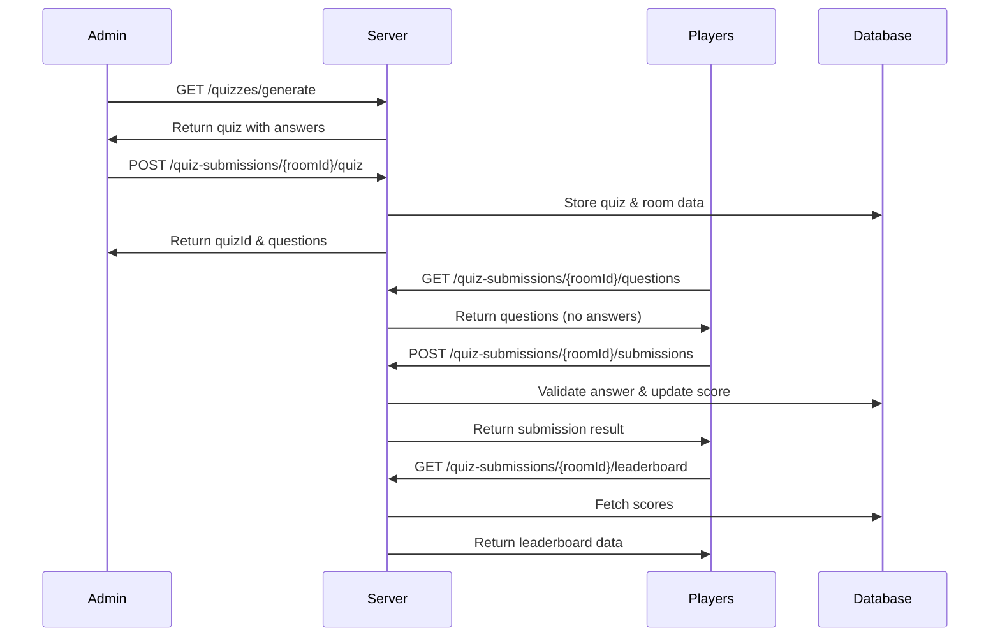

## Overview

The multiplayer quiz flow in IntelliQ involves several API endpoints that handle quiz generation, submission, and leaderboard functionality. This guide explains the complete flow from quiz creation to viewing results.

## Flow Diagram



<Steps>
  1. **Generate Quiz** (Admin Only)
     ```http
     GET /api/v1/quizzes/generate
     ```
     Generate a new quiz with specified parameters:
     ```bash
     ?quizTopic=formula%20one&numberOfQuestions=2&language=en&quizType=multiplayer
     ```
     The response includes the quiz structure with questions and answers.

2. **Create Quiz Room** (Admin Only)

   ```http
   POST /api/v1/quiz-submissions/{roomId}/quiz
   ```

   Create a new quiz room with the generated quiz content. The `roomId` is a unique identifier for the multiplayer session.

   The response includes:

   - `quizId`: Unique identifier for the quiz
   - `questions`: Array of questions with their IDs

3. **Get Quiz Questions** (Players)

   ```http
   GET /api/v1/quiz-submissions/{roomId}/questions
   ```

   Players retrieve quiz questions without correct answers. Response includes:

   - Quiz title and ID
   - Questions with options (no correct answers)
   - Question IDs for submission

4. **Submit Answers** (One at a time)

   ```http
   POST /api/v1/quiz-submissions/{roomId}/submissions
   ```

   Players submit answers one at a time, with the time taken to answer:

   ```json
   {
     "questionId": "question-uuid",
     "userAnswer": "selected answer",
     "timeTaken": 3500
   }
   ```

   The server:

   - Validates if the answer is correct
   - Calculates points based on time taken using the formula:
     `points = Math.round((1 - (timeTaken / timeLimit) / 2.2) * 1000)`
   - Adds bonus points for fast answers (under 10% of time limit)
   - Updates the user's total score
   - Returns the calculated score and submission details

5. **View Leaderboard**
   ```http
   GET /api/v1/quiz-submissions/{roomId}/leaderboard
   ```
   Retrieve the current leaderboard for the quiz room, showing all players' scores and correct answers.
</Steps>

## Response Examples

<CodeGroup>
  ```json Generate Quiz Response (Admin Only)
  {
    "quiz": {
      "quizTitle": "Formula One Trivia Challenge",
      "questions": [
        {
          "questionTitle": "The Fastest Lap Record",
          "text": "Which driver holds the record for the fastest lap in Formula One history?",
          "options": ["a) Lewis Hamilton", "b) Michael Schumacher", "c) Max Verstappen", "d) Sebastian Vettel"],
          "correctAnswer": "c) Max Verstappen"
        }
      ]
    }
  }
  ```

```json Get Questions Response (Players)
{
  "quizId": "557e75e4-d80e-4463-a282-f449190d4d1e",
  "quizTitle": "Formula One Trivia Challenge",
  "questions": [
    {
      "id": "1e45e088-aeac-49c5-8314-34638c89eec9",
      "questionTitle": "The Fastest Lap Record",
      "text": "Which driver holds the record for the fastest lap in Formula One history?",
      "options": [
        "a) Lewis Hamilton",
        "b) Michael Schumacher",
        "c) Max Verstappen",
        "d) Sebastian Vettel"
      ]
    }
  ]
}
```

```json Submit Answer Response
{
  "success": true,
  "submission": {
    "id": "5e2b18d9-f9b2-4a72-9e44-8c31f7a2b98c",
    "userId": "dabaa1d5-2d3f-47c9-8a64-8a79d30f3b7d",
    "quizId": "557e75e4-d80e-4463-a282-f449190d4d1e",
    "roomId": "0cc667ab-46f9-4f9a-a04d-4034f1d22230",
    "userScore": 850,
    "correctAnswersCount": 1,
    "createdAt": "2025-02-27T11:01:52.911594+00"
  },
  "calculatedScore": 850,
  "totalQuestions": 4
}
```

```json Leaderboard Response
{
  "leaderboard": [
    {
      "userName": "Player 1",
      "score": 2750,
      "correctAnswers": 3
    },
    {
      "userName": "Player 2",
      "score": 2100,
      "correctAnswers": 2
    }
  ]
}
```

</CodeGroup>

## Scoring Mechanics

The time-based scoring system rewards both accuracy and speed:

1. **Base Formula**: `points = Math.round((1 - (timeTaken / timeLimit) / 2.2) * 1000)`
2. **Fast Answer Bonus**: +50 points for answers under 10% of the time limit
3. **Minimum Points**: All correct answers earn at least 100 points
4. **Incorrect Answers**: 0 points

Each user's total score accumulates as they answer questions, and their submission record is updated rather than creating multiple records.

## Error Handling

The API will return appropriate error codes and messages if:

- The quiz generation parameters are invalid
- The room ID doesn't exist
- The question ID is invalid or doesn't belong to the quiz
- The user is not authorized to access the room
