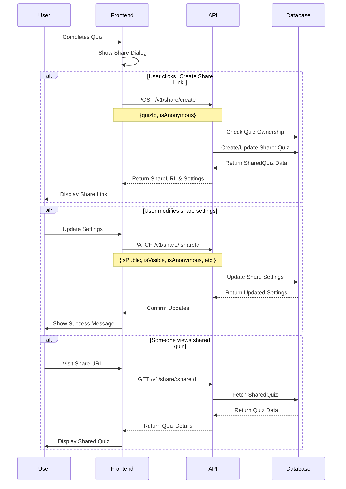

## Overview

The quiz sharing flow in IntelliQ allows users to share their completed quizzes with others. This guide explains the complete flow from sharing a quiz to viewing shared quiz details.

## Flow Diagram



<Steps>
  1. **Share Quiz** (Quiz Owner Only)
     ```http
     POST /api/v1/share/singleplayer
     ```
     Share a completed quiz with specified visibility settings:
     ```json
     {
       "quizId": "quiz-uuid",
       "isAnonymous": false,
       "isPublic": true
     }
     ```
     The response includes the share URL and settings:
     ```json
     {
       "shareId": "share-uuid",
       "shareUrl": "http://example.com/api/v1/share/share-uuid",
       "isAnonymous": false,
       "isPublic": true,
       "type": "singleplayer",
       "quiz": {
         "quizId": "quiz-uuid",
         "title": "Quiz Title"
       }
     }
     ```

2. **Update Share Settings** (Quiz Owner Only)

   ```http
   PATCH /api/v1/share/{shareId}
   ```

   Update visibility settings for a shared quiz:

   ```json
   {
     "isPublic": true,
     "isAnonymous": false
   }
   ```

   The response includes:

   - Updated share settings
   - Complete quiz details
   - Performance statistics
   - Share URL

3. **View Shared Quiz** (Public Access)

   ```http
   GET /api/v1/share/{shareId}
   ```

   Retrieve the shared quiz details, including:

   - Quiz content and metadata
   - Creator information (if not anonymous)
   - Share settings and URL
   - Performance statistics

</Steps>

## Response Examples

<CodeGroup>
```json Share Quiz Response
{
  "shareId": "fd33a26c-4dfa-4975-8c7a-f3f929d6fbbc",
  "shareUrl": "http://localhost:8787/api/v1/share/fd33a26c-4dfa-4975-8c7a-f3f929d6fbbc",
  "isAnonymous": false,
  "isPublic": false,
  "type": "singleplayer",
  "quiz": {
    "quizId": "06e4d10a-df91-4703-89f3-0ea4ddb72c8b",
    "title": "Anime Enthusiast Challenge"
  }
}
```

```json Update Share Response
{
  "shareId": "fd33a26c-4dfa-4975-8c7a-f3f929d6fbbc",
  "shareUrl": "http://localhost:8787/api/v1/share/fd33a26c-4dfa-4975-8c7a-f3f929d6fbbc",
  "isPublic": true,
  "isAnonymous": false,
  "type": "singleplayer",
  "quiz": {
    "id": "06e4d10a-df91-4703-89f3-0ea4ddb72c8b",
    "userId": "dabaa1d5-2d3f-47c9-8a64-8a79d73574f3",
    "title": "Anime Enthusiast Challenge",
    "description": "not much",
    "topic": ["anime"],
    "tags": ["YESYES"],
    "passingScore": 54,
    "documentId": null,
    "type": "singleplayer",
    "createdAt": "2025-02-12 00:52:02.521588+00",
    "language": "en",
    "userScore": 55,
    "correctAnswersCount": 3,
    "questionsCount": 4,
    "roomId": null,
    "totalTimeTaken": 5,
    "passed": true
  }
}
```

```json View Shared Quiz Response
{
  "quiz": {
    "id": "06e4d10a-df91-4703-89f3-0ea4ddb72c8b",
    "userId": "dabaa1d5-2d3f-47c9-8a64-8a79d73574f3",
    "title": "Anime Enthusiast Challenge",
    "description": "not much",
    "topic": ["anime"],
    "tags": ["YESYES"],
    "passingScore": 54,
    "documentId": null,
    "type": "singleplayer",
    "createdAt": "2025-02-12T00:52:02.521588+00:00",
    "language": "en",
    "userScore": 55,
    "correctAnswersCount": 3,
    "questionsCount": 4,
    "roomId": null,
    "totalTimeTaken": 5,
    "passed": true,
    "createdBy": "admin"
  },
  "shareId": "5a4934bd-549a-429e-a4a1-456466eaec5e",
  "shareUrl": "http://localhost:8787/api/v1/share/5a4934bd-549a-429e-a4a1-456466eaec5e",
  "isPublic": true,
  "isAnonymous": false,
  "type": "singleplayer"
}
```

</CodeGroup>

## Error Handling

The API will return appropriate error codes and messages if:

- The quiz ID doesn't exist
- The user is not authorized to share the quiz
- The share ID is invalid
- The shared quiz is not public
- The user is not authorized to modify share settings

## Share Settings

- **isPublic**: Controls whether the quiz is accessible to anyone with the share URL
- **isAnonymous**: Determines if the creator's name is displayed when viewing the shared quiz
- **shareUrl**: A unique URL that can be used to access the shared quiz
- **shareId**: A unique identifier for the shared quiz instance

## Security Considerations

1. Only quiz owners can create and modify share settings
2. Non-public quizzes are not accessible even with the share URL
3. Anonymous sharing hides creator information but maintains quiz content
4. Share URLs are unique and cryptographically secure
