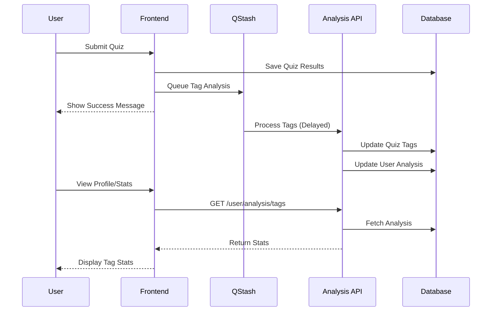

## Overview

The tag analysis system in IntelliQ automatically processes quiz content to generate relevant tags and categories, maintaining user statistics for both user-provided and AI-generated tags. This system works asynchronously using QStash to ensure smooth quiz submission experience.

## Flow Diagram



## Data Structure

The system maintains two levels of tag data:

1. **Quiz Level** (in `quizzes` table):
```typescript
{
  generatedTags: string[],      // AI-generated tags for this quiz
  generatedCategories: string[] // Broader categories for this quiz
}
```

2. **User Level** (in `userAnalysis` table):
```typescript
{
  userTags: { tag: string; count: number }[],           // User-provided tags
  generatedTags: { tag: string; count: number }[],      // AI-generated tags
  generatedCategories: { category: string; count: number }[] // AI-generated categories
}
```

<Steps>
  1. **Quiz Submission**
     When a user completes a quiz (singleplayer or multiplayer), the system:
     ```http
     POST /api/v1/quiz-submissions/{type}
     ```
     The submission triggers a QStash job for tag analysis.

  2. **Tag Analysis (Async)**
     ```http
     POST /api/v1/admin/tags/analyze
     ```
     The analysis job:
     - Generates tags and categories using AI
     - Updates the quiz record
     - Updates user statistics
     - Invalidates relevant caches

  3. **Retrieve User Analysis**
     ```http
     GET /api/v1/user/analysis/tags
     ```
     Returns the user's tag statistics and preferences.

  4. **Get Top Categories**
     ```http
     GET /api/v1/user/analysis/top-categories
     ```
     Returns the user's most frequent quiz categories.
</Steps>

## Response Examples

<CodeGroup>
```json Quiz Tags Response
{
  "success": true,
  "quizId": "557e75e4-d80e-4463-a282-f449190d4d1e",
  "tags": ["physics", "mechanics", "newton-laws"],
  "categories": ["Science", "Physics"]
}
```

```json User Analysis Response
{
  "generatedTags": [
    { "tag": "physics", "count": 15 },
    { "tag": "mathematics", "count": 12 }
  ],
  "generatedCategories": [
    { "category": "Science", "count": 25 },
    { "category": "Mathematics", "count": 18 }
  ],
  "userTags": [
    { "tag": "hard", "count": 5 },
    { "tag": "exam-prep", "count": 3 }
  ]
}
```
</CodeGroup>

## Technical Implementation

1. **QStash Integration**
   - Uses `@upstash/qstash` for reliable async processing
   - Configurable delay to batch process tags
   - Automatic retries on failure

2. **Cache Management**
   - User cache version incremented after analysis
   - Ensures frontend receives updated statistics

3. **Database Schema**
   ```sql
   -- Quiz tags
   ALTER TABLE quizzes
   ADD COLUMN generated_tags text[],
   ADD COLUMN generated_categories text[];

   -- User analysis
   CREATE TABLE user_analysis (
     id uuid PRIMARY KEY DEFAULT gen_random_uuid(),
     user_id uuid REFERENCES users(id),
     user_tags jsonb[],
     generated_tags jsonb[],
     generated_categories jsonb[],
     created_at timestamptz DEFAULT now(),
     updated_at timestamptz NOT NULL
   );
   ```

## Error Handling

The system handles various error cases:
- Failed AI tag generation
- Database transaction failures
- Invalid quiz references
- Rate limiting
- Cache invalidation issues

Each error is logged and retried through QStash's built-in retry mechanism.

## Security Considerations

1. Tag analysis endpoint protected by admin token
2. User analysis data access restricted to owner
3. Rate limiting on analysis requests
4. Sanitization of AI-generated tags
5. Validation of user-provided tags

## Benefits

1. **Asynchronous Processing**
   - No delay in quiz submission
   - Better user experience
   - Reduced server load

2. **Rich Metadata**
   - Improved quiz discovery
   - Better content organization
   - Personalized recommendations

3. **User Insights**
   - Track user interests
   - Identify popular categories
   - Guide content creation

Written by [Ricky Raveanu](mailto:contact@rickyraveanu.com)